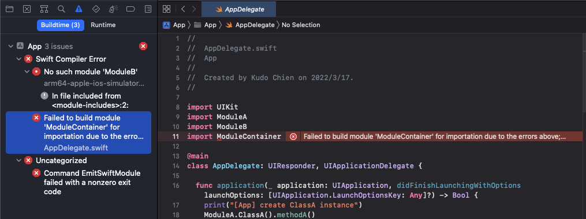
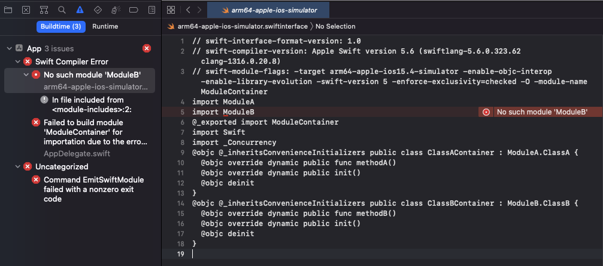

# Swift-Module-Issue
Minimal Reproducible Example of swiftinterface module resolution doesn't respect `-fmodule-map-file`.

```
-fmodule-map-file=<file>
  Load the given module map file if a header from its directory or one of its subdirectories is loaded.
```

This is a way to specify custom modulemap filename other than the default `module.modulemap` name. CocoaPods heavily uses this compiler flag for its module system.


# Modules walkthrough

## `ModuleA`

This project is just a static library with a `ClassA`.

```objc
@interface ClassA : NSObject

- (void)methodA;

@end
```

To convert this static library as a clang module, this project adds a modulemap file with standard name - `module.modulemap`.

```
CLANG_ENABLE_MODULES = YES;
DEFINES_MODULE = YES;
MODULEMAP_FILE = module.modulemap;
```

module.modulemap

```
module ModuleA {
  umbrella header "ModuleA.h"

  export *
  module * { export * }
}
```

## `ModuleB`

This project is pretty much like the `ModuleA` but having a custom modulemap name - `ModuleB.modulemap` and a different class `ClassB`.

```
MODULEMAP_FILE = ModuleB.modulemap;
```

## `ModuleContainer`

This is a Swift Framework project subclassing classes from both `ModuleA` and `ModuleB`.

```swift
import ModuleA
import ModuleB

public class ClassAContainer : ModuleA.ClassA {
  public override func methodA() {
    print("[ClassContainer] overridden methodA called")
  }
}

public class ClassBContainer : ModuleB.ClassB {
  public override func methodB() {
    print("[ClassContainer] overridden methodB called")
  }
}
```

To add dependencies to `ModuleA` and `ModuleB`, this project adds these settings:

```
OTHER_LDFLAGS = ("-lModuleA", "-lModuleB")
OTHER_CFLAGS = (
  "$(inherited)",
  "-fmodule-map-file=\"${SRCROOT}/../ModuleA/ModuleA/module.modulemap\"",
  "-fmodule-map-file=\"${SRCROOT}/../ModuleB/ModuleB/ModuleB.modulemap\"",
);
OTHER_SWIFT_FLAGS = "$(inherited) -Xcc -fmodule-map-file=\"${SRCROOT}/../ModuleA/ModuleA/module.modulemap\" -Xcc -fmodule-map-file=\"${SRCROOT}/../ModuleB/ModuleB/ModuleB.modulemap\""
```

This project is built as a xcframework by [the commands](https://github.com/Kudo/Swift-Module-Issue/blob/main/build_xcframework.sh) and [comitted into git](https://github.com/Kudo/Swift-Module-Issue/tree/main/ModuleContainer.xcframework)  

## `App`

This project is a iOS app which integrates with all the modules.

```swift
import ModuleA
import ModuleB
import ModuleContainer

@main
class AppDelegate: UIResponder, UIApplicationDelegate {

  func application(_ application: UIApplication, didFinishLaunchingWithOptions launchOptions: [UIApplication.LaunchOptionsKey: Any]?) -> Bool {
    print("[App] create ClassA instance")
    ModuleA.ClassA().methodA()

    print("[App] create ClassB instance")
    ModuleB.ClassB().methodB()

    print("[App] create ClassContainer instance")
    ModuleContainer.ClassContainer().methodA()

    // Override point for customization after application launch.
    return true
  }
}
```

To add dependencies for ModuleA and ModuleB, the project add these settings:

```
OTHER_LDFLAGS = ("-lModuleA", "-lModuleB")
OTHER_CFLAGS = (
  "$(inherited)",
  "-fmodule-map-file=\"${SRCROOT}/../ModuleA/ModuleA/module.modulemap\"",
  "-fmodule-map-file=\"${SRCROOT}/../ModuleB/ModuleB/ModuleB.modulemap\"",
);
OTHER_SWIFT_FLAGS = "$(inherited) -Xcc -fmodule-map-file=\"${SRCROOT}/../ModuleA/ModuleA/module.modulemap\" -Xcc -fmodule-map-file=\"${SRCROOT}/../ModuleB/ModuleB/ModuleB.modulemap\""
SWIFT_INCLUDE_PATHS = "\"${SRCROOT}/../ModuleA/ModuleA\" \"${SRCROOT}/../ModuleB/ModuleB\"";
```

However, this project add dependency to ModuleContainer through the prebuild `ModuleContainer.xcframework`.

```
FRAMEWORK_SEARCH_PATHS = "\"${SRCROOT}/../ModuleContainer.xcframework\"/**";
```

# Result of module resolutions

- ✅ ModuleContainer -> ModuleA
  - by `-fmodule-map-file=`
- ✅ ModuleContainer -> ModuleB
  - by `-fmodule-map-file=`
- ✅ App -> ModuleA
  - by `-fmodule-map-file=`
- ✅ App -> ModuleB
  - by `-fmodule-map-file=`
- ✅ App -> ModuleContainer (swiftinterface) -> ModuleA
  - swiftinterface doesn't respect `-fmodule-map-file=`. since `ModuleA` has the standard `module.modulemap` name. ModuleA is still reachable by `SWIFT_INCLUDE_PATHS = "\"${SRCROOT}/../ModuleA/ModuleA\" \"${SRCROOT}/../ModuleB/ModuleB\"";`.
- ❌ App -> ModuleContainer (swiftinterface) -> ModuleB
  - swiftinterface doesn't respect `-fmodule-map-file=`. ModuleB has custom modulemap name `ModuleB.modulemap` is not reachable.

the compile error is something like this:





```
CompileSwift normal x86_64 /Users/kudo/SwiftIssue/App/App/SceneDelegate.swift (in target 'App' from project 'App')
    cd /Users/kudo/SwiftIssue/App
    /Applications/Xcode.app/Contents/Developer/Toolchains/XcodeDefault.xctoolchain/usr/bin/swift-frontend -frontend -c /Users/kudo/SwiftIssue/App/App/ViewController.swift /Users/kudo/SwiftIssue/App/App/AppDelegate.swift -primary-file /Users/kudo/SwiftIssue/App/App/SceneDelegate.swift -emit-dependencies-path /Users/kudo/Library/Developer/Xcode/DerivedData/SwiftIssue-dkubhfivwlkbwefrzralcgvppcaw/Build/Intermediates.noindex/App.build/Debug-iphonesimulator/App.build/Objects-normal/x86_64/SceneDelegate.d -emit-reference-dependencies-path /Users/kudo/Library/Developer/Xcode/DerivedData/SwiftIssue-dkubhfivwlkbwefrzralcgvppcaw/Build/Intermediates.noindex/App.build/Debug-iphonesimulator/App.build/Objects-normal/x86_64/SceneDelegate.swiftdeps -serialize-diagnostics-path /Users/kudo/Library/Developer/Xcode/DerivedData/SwiftIssue-dkubhfivwlkbwefrzralcgvppcaw/Build/Intermediates.noindex/App.build/Debug-iphonesimulator/App.build/Objects-normal/x86_64/SceneDelegate.dia -emit-localized-strings -emit-localized-strings-path /Users/kudo/Library/Developer/Xcode/DerivedData/SwiftIssue-dkubhfivwlkbwefrzralcgvppcaw/Build/Intermediates.noindex/App.build/Debug-iphonesimulator/App.build/Objects-normal/x86_64 -target x86_64-apple-ios15.4-simulator -enable-objc-interop -sdk /Applications/Xcode.app/Contents/Developer/Platforms/iPhoneSimulator.platform/Developer/SDKs/iPhoneSimulator15.4.sdk -I /Users/kudo/Library/Developer/Xcode/DerivedData/SwiftIssue-dkubhfivwlkbwefrzralcgvppcaw/Build/Products/Debug-iphonesimulator -I /Users/kudo/SwiftIssue/ModuleA/ModuleA -I /Users/kudo/SwiftIssue/ModuleB/ModuleB -F /Users/kudo/Library/Developer/Xcode/DerivedData/SwiftIssue-dkubhfivwlkbwefrzralcgvppcaw/Build/Products/Debug-iphonesimulator -F /Users/kudo/SwiftIssue/ModuleContainer.xcframework -F /Users/kudo/SwiftIssue/ModuleContainer.xcframework/ios-arm64_x86_64-simulator -enable-testing -g -module-cache-path /Users/kudo/Library/Developer/Xcode/DerivedData/ModuleCache.noindex -swift-version 5 -enforce-exclusivity\=checked -Onone -D DEBUG -new-driver-path /Applications/Xcode.app/Contents/Developer/Toolchains/XcodeDefault.xctoolchain/usr/bin/swift-driver -serialize-debugging-options -Xcc -working-directory -Xcc /Users/kudo/SwiftIssue/App -resource-dir /Applications/Xcode.app/Contents/Developer/Toolchains/XcodeDefault.xctoolchain/usr/lib/swift -enable-anonymous-context-mangled-names -Xcc -fmodule-map-file\=/Users/kudo/SwiftIssue/App/../ModuleA/ModuleA/module.modulemap -Xcc -fmodule-map-file\=/Users/kudo/SwiftIssue/App/../ModuleB/ModuleB/ModuleB.modulemap -Xcc -I/Users/kudo/Library/Developer/Xcode/DerivedData/SwiftIssue-dkubhfivwlkbwefrzralcgvppcaw/Build/Intermediates.noindex/App.build/Debug-iphonesimulator/App.build/swift-overrides.hmap -Xcc -iquote -Xcc /Users/kudo/Library/Developer/Xcode/DerivedData/SwiftIssue-dkubhfivwlkbwefrzralcgvppcaw/Build/Intermediates.noindex/App.build/Debug-iphonesimulator/App.build/App-generated-files.hmap -Xcc -I/Users/kudo/Library/Developer/Xcode/DerivedData/SwiftIssue-dkubhfivwlkbwefrzralcgvppcaw/Build/Intermediates.noindex/App.build/Debug-iphonesimulator/App.build/App-own-target-headers.hmap -Xcc -I/Users/kudo/Library/Developer/Xcode/DerivedData/SwiftIssue-dkubhfivwlkbwefrzralcgvppcaw/Build/Intermediates.noindex/App.build/Debug-iphonesimulator/App.build/App-all-non-framework-target-headers.hmap -Xcc -ivfsoverlay -Xcc /Users/kudo/Library/Developer/Xcode/DerivedData/SwiftIssue-dkubhfivwlkbwefrzralcgvppcaw/Build/Intermediates.noindex/App.build/Debug-iphonesimulator/App.build/all-product-headers.yaml -Xcc -iquote -Xcc /Users/kudo/Library/Developer/Xcode/DerivedData/SwiftIssue-dkubhfivwlkbwefrzralcgvppcaw/Build/Intermediates.noindex/App.build/Debug-iphonesimulator/App.build/App-project-headers.hmap -Xcc -I/Users/kudo/Library/Developer/Xcode/DerivedData/SwiftIssue-dkubhfivwlkbwefrzralcgvppcaw/Build/Products/Debug-iphonesimulator/include -Xcc -I/Users/kudo/Library/Developer/Xcode/DerivedData/SwiftIssue-dkubhfivwlkbwefrzralcgvppcaw/Build/Intermediates.noindex/App.build/Debug-iphonesimulator/App.build/DerivedSources-normal/x86_64 -Xcc -I/Users/kudo/Library/Developer/Xcode/DerivedData/SwiftIssue-dkubhfivwlkbwefrzralcgvppcaw/Build/Intermediates.noindex/App.build/Debug-iphonesimulator/App.build/DerivedSources/x86_64 -Xcc -I/Users/kudo/Library/Developer/Xcode/DerivedData/SwiftIssue-dkubhfivwlkbwefrzralcgvppcaw/Build/Intermediates.noindex/App.build/Debug-iphonesimulator/App.build/DerivedSources -Xcc -DDEBUG\=1 -module-name App -target-sdk-version 15.4 -o /Users/kudo/Library/Developer/Xcode/DerivedData/SwiftIssue-dkubhfivwlkbwefrzralcgvppcaw/Build/Intermediates.noindex/App.build/Debug-iphonesimulator/App.build/Objects-normal/x86_64/SceneDelegate.o -index-unit-output-path /App.build/Debug-iphonesimulator/App.build/Objects-normal/x86_64/SceneDelegate.o -index-store-path /Users/kudo/Library/Developer/Xcode/DerivedData/SwiftIssue-dkubhfivwlkbwefrzralcgvppcaw/Index/DataStore -index-system-modules
/Users/kudo/SwiftIssue/ModuleContainer.xcframework/ios-arm64_x86_64-simulator/ModuleContainer.framework/Modules/ModuleContainer.swiftmodule/x86_64-apple-ios-simulator.swiftinterface:5:8: error: no such module 'ModuleB'
import ModuleB
       ^
<module-includes>:2:9: note: in file included from <module-includes>:2:
#import "Headers/ModuleContainer-Swift.h"
        ^
/Users/kudo/SwiftIssue/App/App/AppDelegate.swift:11:8: error: failed to build module 'ModuleContainer' for importation due to the errors above; the textual interface may be broken by project issues or a compiler bug
import ModuleContainer
       ^
/Users/kudo/SwiftIssue/ModuleContainer.xcframework/ios-arm64_x86_64-simulator/ModuleContainer.framework/Modules/ModuleContainer.swiftmodule/x86_64-apple-ios-simulator.swiftinterface:5:8: error: no such module 'ModuleB'
import ModuleB
       ^
<module-includes>:2:9: note: in file included from <module-includes>:2:
#import "Headers/ModuleContainer-Swift.h"
        ^
```

# How to run this example

Run this command to compile the `App` target

`xcodebuild build -workspace SwiftIssue.xcworkspace -scheme App -sdk iphonesimulator`

### Rebuild `ModuleContainer.xcframework`

The prebuilt `ModuleContainer.xcframework` is committed into git. If you want to rebuild the xcframework, you can run the `build_xcframework.sh` script.
